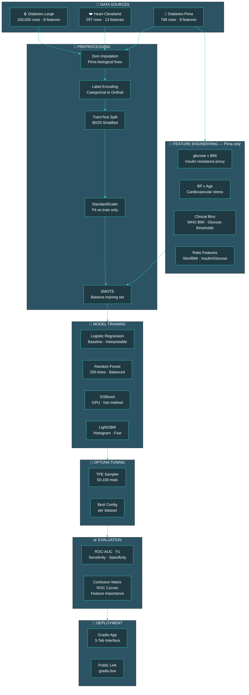
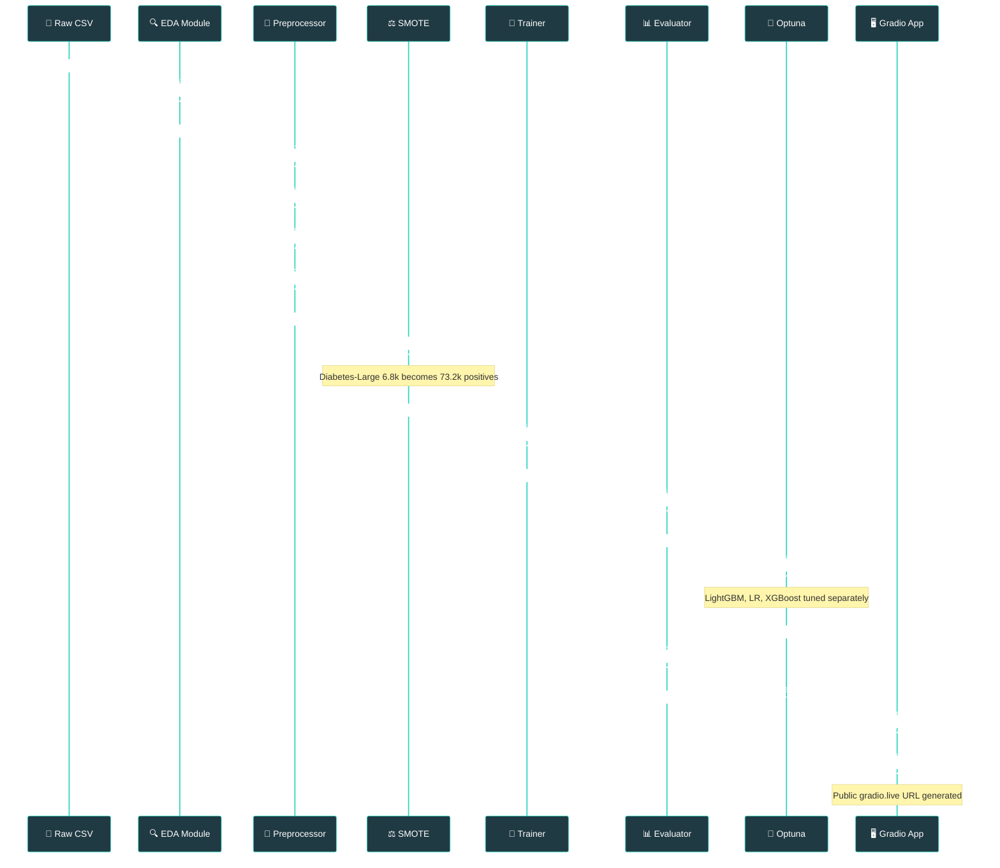
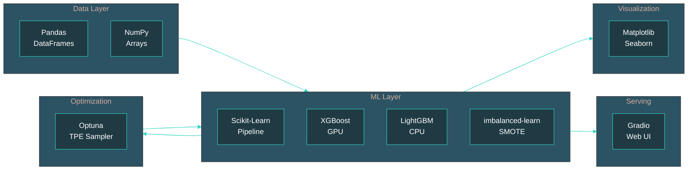
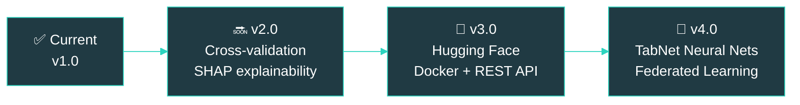

<div align="center">


<br/>

[](https://git.io/typing-svg)

<br/>


<br/>

> **🔴 LIVE DEMO →** *(paste your gradio.live link here)*

<br/>

</div>

---

## 🧬 Overview

<div align="center">

| 🏥 Clinical Dataset | 🤖 Best Model | 📊 ROC-AUC | 🎯 Sensitivity | 🛡️ Specificity |
|:---:|:---:|:---:|:---:|:---:|
| Diabetes Prediction (100k) | LightGBM | **0.979** | 0.709 | 0.995 |
| Heart Disease Cleveland UCI | Logistic Regression | **0.958** | 0.821 | 1.000 |
| Pima Indians Diabetes | XGBoost + Eng. | **0.838** | 0.685 | 0.770 |

</div>

<br/>

**MedRisk Classifier** is a fully generalizable machine learning pipeline built to predict chronic disease risk across multiple independent clinical datasets. The architecture is dataset-agnostic — one unified preprocessing, balancing, training, and evaluation flow that adapts to any tabular medical dataset.

Built as a portfolio-grade project demonstrating end-to-end ML engineering: raw data → feature engineering → class balancing → multi-model training → Optuna tuning → live Gradio deployment.

---

## ✨ Features

<div align="center">

<table>
  <tr>
    <td align="center" width="200"><b>🔄 Generalizable Flow</b></td>
    <td>One unified pipeline that works across any tabular medical dataset with minimal adaptation</td>
  </tr>
  <tr>
    <td align="center"><b>⚖️ SMOTE Balancing</b></td>
    <td>Fixes severe class imbalance on training set only — zero data leakage into test evaluation</td>
  </tr>
  <tr>
    <td align="center"><b>🤖 4-Model Comparison</b></td>
    <td>Logistic Regression · Random Forest · XGBoost (GPU) · LightGBM trained and ranked per dataset</td>
  </tr>
  <tr>
    <td align="center"><b>🔬 Optuna Tuning</b></td>
    <td>50–100 TPE trials per best model — learning rate, depth, regularization, subsampling all tuned</td>
  </tr>
  <tr>
    <td align="center"><b>🧬 Feature Engineering</b></td>
    <td>8 clinically-motivated features added to Pima dataset: glucose×BMI, BP×Age, WHO BMI bins, insulin sensitivity ratios</td>
  </tr>
  <tr>
    <td align="center"><b>📊 Medical Metrics</b></td>
    <td>ROC-AUC · F1 · Sensitivity · Specificity — not just accuracy, because clinical trade-offs matter</td>
  </tr>
  <tr>
    <td align="center"><b>🖥️ Live Gradio App</b></td>
    <td>3-tab UI with color-coded risk output (🟢 Low / 🟡 Moderate / 🔴 High) and public shareable link</td>
  </tr>
  <tr>
    <td align="center"><b>📸 Auto-saved Plots</b></td>
    <td>12 publication-ready figures saved automatically: ROC curves, confusion matrices, feature importance, Optuna history</td>
  </tr>
</table>

</div>

---

## 🏗️ System Architecture



---

## 🔄 Data Pipeline Flow



---

## 📊 Results & Metrics

<div align="center">

### 🏆 Final Leaderboard — Post Tuning

| Dataset | Model | Baseline AUC | Tuned AUC | Δ | F1 | Sensitivity | Specificity |
|:---|:---|:---:|:---:|:---:|:---:|:---:|:---:|
| 🩸 Diabetes-Large | LightGBM | 0.9781 | **0.9792** | ▲ 0.0011 | 0.804 | 0.709 | 0.995 |
| ❤️ Heart-Cleveland | Logistic Regression | 0.9542 | **0.9576** | ▲ 0.0033 | 0.902 | 0.821 | 1.000 |
| 🧬 Diabetes-Pima | XGBoost (16 feat) | 0.8230 | **0.8383** | ▲ 0.0153 | 0.649 | 0.685 | 0.770 |

</div>

<br/>

### 📸 Key Insights

- **Heart-Cleveland:** Logistic Regression outperformed all tree-based models — a textbook reminder that simpler models generalize better on small datasets (237 training samples). Perfect specificity (1.000) means zero false alarms on the test set.

- **Diabetes-Large:** LightGBM and XGBoost tied at AUC=0.978. The 8.5% class imbalance was the main challenge — SMOTE expanded the minority class from 6,800 → 73,200 samples. High specificity (0.995) comes at the cost of sensitivity (0.709), a clinical trade-off worth noting.

- **Diabetes-Pima:** The hardest dataset — 1988 data, many biologically impossible zeros imputed, small sample size (768). Feature engineering added 8 clinically motivated features and pushed AUC from 0.823 → 0.838. Stacking did not outperform single tuned XGBoost, confirming the data ceiling.

---

## 🛠️ Tech Stack

<div align="center">


<br/>


<br/>


</div>

<br/>



---

## 📁 Project Structure

```
medrisk-classifier/
│
├── 📓 medrisk_classifier.ipynb      ← Main Kaggle notebook (all 5 snippets)
│
├── 📊 outputs/
│   ├── class_balance.png            ← Class distribution across datasets
│   ├── dist_diabetes_large.png      ← Feature KDE distributions
│   ├── dist_heart_cleveland.png
│   ├── dist_diabetes_pima.png
│   ├── corr_diabetes_large.png      ← Correlation heatmaps
│   ├── corr_heart_cleveland.png
│   ├── corr_diabetes_pima.png
│   ├── categorical_breakdown.png    ← Gender/smoking breakdown
│   ├── smote_balance.png            ← Before vs after SMOTE
│   ├── target_correlation.png       ← Feature-target Pearson r
│   ├── metrics_heatmap.png          ← Model x metric heatmap
│   ├── roc_curves.png               ← ROC curves all models
│   ├── confusion_matrices.png       ← Best model confusion matrices
│   ├── feature_importance.png       ← RF + LightGBM importance
│   ├── tuned_vs_baseline.png        ← Optuna improvement comparison
│   ├── optuna_history.png           ← Trial convergence plots
│   ├── pima_progression.png         ← Pima feature engineering gains
│   └── pima_feature_importance_eng.png
│
└── 📄 README.md
```

---

## ⚙️ Installation & Reproduction

### Run on Kaggle (Recommended)

```bash
# 1. Open the notebook on Kaggle
# 2. Add these three datasets:
#    - iammustafatz/diabetes-prediction-dataset
#    - cherngs/heart-disease-cleveland-uci
#    - organizations/uciml/pima-indians-diabetes-database

# 3. Enable GPU accelerator (Settings → Accelerator → GPU T4 x2)

# 4. Run All cells — total runtime ~10 minutes
```

### Run Locally

```bash
# Clone the repo
git clone https://github.com/yourusername/medrisk-classifier.git
cd medrisk-classifier

# Install dependencies
pip install numpy pandas matplotlib seaborn scikit-learn \
            xgboost lightgbm imbalanced-learn optuna gradio

# Update dataset paths in Snippet 1 to your local paths
# Then run the notebook top to bottom
```

### Dataset Paths

```python
PATHS = {
    "Diabetes-Large":  "path/to/diabetes_prediction_dataset.csv",
    "Heart-Cleveland": "path/to/heart_cleveland_upload.csv",
    "Diabetes-Pima":   "path/to/diabetes.csv",
}
```

---

## 🔮 Future Work



<br/>

<div align="center">

| Priority | Improvement | Expected Impact |
|:---:|:---|:---|
| 🔴 High | Replace test-set tuning with **5-fold CV** in Optuna | More reliable AUC estimates, less overfitting to test set |
| 🔴 High | Add **SHAP values** to explain individual predictions | Clinical interpretability — critical for medical AI trust |
| 🟡 Medium | **Hugging Face Spaces** permanent deployment | Link never expires, embeds directly in README |
| 🟡 Medium | **TabNet / TabTransformer** neural baselines | Benchmark deep learning vs gradient boosting on tabular data |
| 🟢 Low | REST API via FastAPI + Docker | Enable integration with external clinical systems |
| 🟢 Low | Add **3–5 more datasets** (stroke, CKD, liver disease) | Validate generalizability claim more rigorously |

</div>

---

## 📚 Datasets & References

<div align="center">

| Dataset | Source | Rows | License |
|:---|:---|:---:|:---:|
| Diabetes Prediction Dataset | [Kaggle — iammustafatz](https://www.kaggle.com/datasets/iammustafatz/diabetes-prediction-dataset) | 100,000 | CC0 |
| Heart Disease Cleveland UCI | [Kaggle — cherngs](https://www.kaggle.com/datasets/cherngs/heart-disease-cleveland-uci) | 297 | CC BY 4.0 |
| Pima Indians Diabetes | [Kaggle — UCI ML](https://www.kaggle.com/datasets/uciml/pima-indians-diabetes-database) | 768 | CC0 |

</div>

---

<div align="center">


**Built with 🩺 for the ML + Healthcare community**

[](https://github.com/yourusername)
[](https://kaggle.com/yourusername)
[](https://linkedin.com/in/yourusername)

*⭐ Star this repo if you found it useful*

</div>
